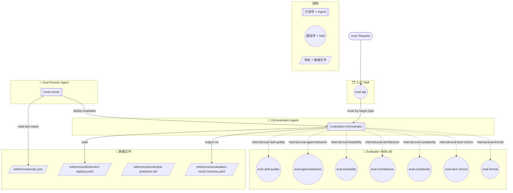

# Evaluation Core Pack — 架构框图

## 维度 → Skill 映射

| 维度 | 对应 Skill |
|------|-----------|
| `skill_quality` | `eval-skill-quality` |
| `agent_behavior` | `eval-agent-behavior` |
| `technical_feasibility` | `eval-feasibility` |
| `architectural_soundness`, `scalability`, `maintainability` | `eval-architecture` |
| `complexity` | `eval-complexity` |
| `cost` | `eval-tech-choice` |
| `format` | `eval-format` |
| `security`, `interoperability`, `documentation` | orchestrator 直接评估 |

## 核心流程说明

| 步骤 | 谁 | 做什么 |
|------|----|--------|
| 1 | `eval-api` **Skill** | 接收用户请求，解析 target type |
| 2 | `evaluation-orchestrator` **Agent** | 查询 `dimension-registry.yaml`，确定维度列表 |
| 3 | `evaluation-orchestrator` | 按 `evaluator_ref` 调度到对应 skill |
| 4 | 各 Evaluator **Skill** | 按各自 rubric 评分 1-5，含 L1 门禁检查 |
| 5 | `evaluation-orchestrator` | 聚合加权得分 → verdict → confidence → 统一 Schema |
| 6 | `eval-runner` **Agent** | 读 `evals.json`，跑迭代，with/without 对比，生成 benchmark |
